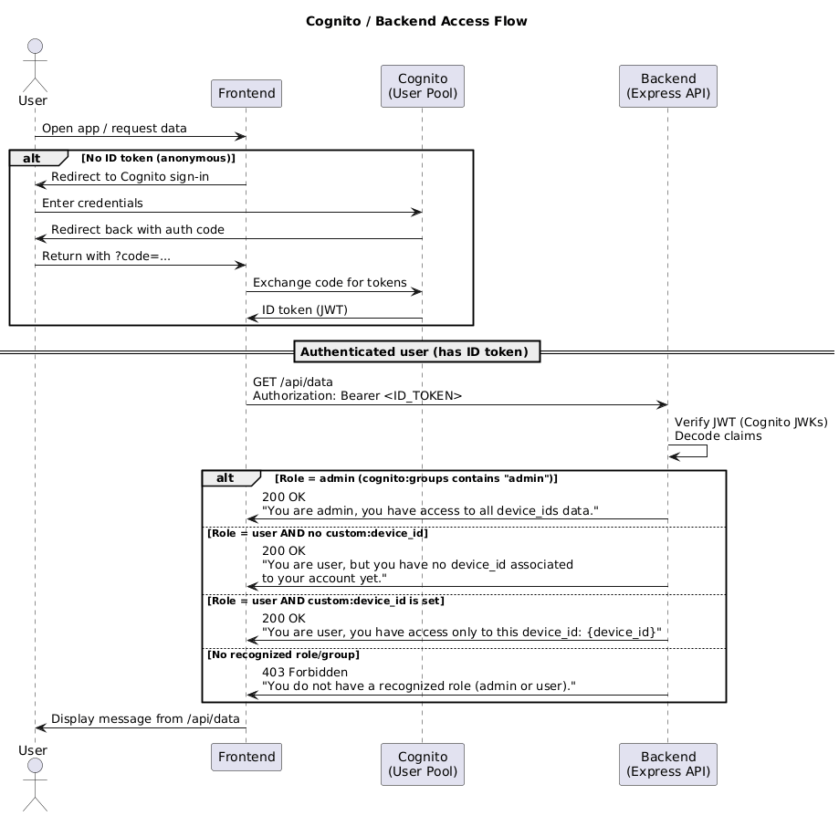

# AWS Cognito Backend and Frontend applications

This repo explains how to configure **AWS Cognito** for:

- One **User Pool** for authentication  
- Two **roles**, implemented as **Cognito Groups**:
  - `admin`
  - `user`
- A **custom attribute** `device_id`, stored as `custom:device_id` and available in ID tokens

No Lambda triggers are required. The attribute `custom:device_id` is included automatically in ID tokens.




## 0. Prerequisites

- AWS account with permissions to manage **Cognito**. Cognito is avaialble in AWS Free Tier account - https://portal.aws.amazon.com/gp/aws/developer/registration/index.html?refid=em_127222&p=free&c=hp2&z=1&target=_blank
- Region selected (e.g., `eu-central-1`).

## 1. Create the Cognito User Pool (New AWS Wizard)

AWS now uses a combined wizard for creating applications and their user pools.

1. Go to **AWS Console -> Amazon Cognito -> User Pools -> Create user pool**  
   Link: https://eu-central-1.console.aws.amazon.com/cognito  
2. Choose **Single-page application (SPA)**. It is recommended for React.
3. Name your application (e.g., `my-spa-app`).
4. **Sign-in identifiers** -> check **Email**.
5. Leave empty **Required attributes for sign-up**
6. Under **Return URL**, set your frontend URL, e.g.:  
   `http://localhost:3000` (this is for devlopment now - when ready you can use Azure/AWS URL of your frontend web app)
7. Finish the wizard by clicking **Create User Directory** to create:
   - The **User Pool**
   - A **Frontend App Client** (public, no secret)

After creation, note:
- **User Pool ID**
- **Cognito Domain**
- **App Client ID**

These values appear under:  
**User pools -> your-pool -> Applications -> App clients**

## 2. Add Custom Attribute: `device_id`

1. Go to **User pools -> your pool -> Sign-up**.
2. Under **Custom attributes**, click **Add custom attribute**.
3. Configure:
   - **Name:** `device_id`
   - **Type:** `String`
   - **Max length:** 300
   - **Mutable:** true
4. Save.

This appears in tokens as:

```json
"custom:device_id": "your-device-id"
```

---

## 3. Create Groups (Roles): `admin` and `user`

1. Go to **Users management -> Groups**.
2. Create the following groups:

### Group: `admin`
- Precedence: 0
- IAM role: *(leave empty)*

### Group: `user`
- Precedence: 10
- IAM role: *(leave empty)*

ID tokens for users in these groups include:

```json
"cognito:groups": ["admin"]
```

or

```json
"cognito:groups": ["user"]
```

These claims and roles are used by the backend for authorization.

## 4. App Client Configuration (Frontend Only)

Because the backend **does not authenticate with Cognito**, you only need **one** app client:

### Frontend Client (Public SPA)

Go to App clients -> select **my-spa-app** -> Login pages and make sure you have the following configurations:

- OAuth grant types:
  - **Authorization code grant**
- OpenID Connect scopes - anything else can be removed (e.g. phone):
  - `openid`
  - `email`
  - `profile` -  important for having the custom attribute claim in the token
- Callback URL:
  - `http://localhost:3000`
- Logout URL:
  - `http://localhost:3000`

* Note: this is the URL of local frontend. After finishing the development, you have to change with the one from Azure/AWS web apps.

Record:
- **App Client ID**
- **Cognito domain**


## 5. Creating Users & Assign Groups

### 5.1 Create a User
1. Go to **User management -> Users -> Create user**.
2. Provide email + set a temporary password. You can select: "Don't send an invitaiton", and put a fake email address (e.g. user@test.com).

Then you can go to the new user and set under **User Attributes**:  `custom:device_id` with a proper device_id that you will use to test your filtering later.

### 5.2 Assign our custom attribute (device_id)
1. Open the user.
2. Go to **User Attributes** tab, press Edit.
3. Add to the additional attributes:
   - `custom:device_id` - proper device_id that you will use to test your filtering later (e.g. "E-001").

### 5.3 Assign to a Group
1. Open the user.
2. Go to **Groups** tab.
3. Add to user group:
   - `user`

Repeat the procedure for the admin user, but don't assign a device_id attribute since they will see everything :D.

## 6. Token Example

A typical Cognito ID token will contain:

```json
{
  "email": "user@example.com",
  "cognito:groups": ["user"],
  "custom:device_id": "device-12345"
}
```

## 7. Frontend Integration

> **_NOTE:_**  You can find a working example of backend using Express framework under **frontend** folder

Your React application must:

1. Use **Cognito Hosted UI** or AWS Amplify Auth to log in.
2. Obtain the **ID token**.
3. Attach the token when calling your backend:

```
Authorization: Bearer <ID_TOKEN>
```

### Token usage in frontend:
- Display user info
- Identify role (`admin` or `user`)
- Show device-based access (`custom:device_id`)

## 8. Backend Integration (Express.js)

> **_NOTE:_**  You can find a working example of backend using Express framework under **backend** folder

The backend does **not** authenticate with Cognito.  
It only **verifies JWTs** issued to the frontend.

### Flow:

1. Receive ID token from frontend in:
   ```
   Authorization: Bearer <ID_TOKEN>
   ```
2. Validate token signature against Cognito’s JWKs:

```
https://cognito-idp.<region>.amazonaws.com/<user-pool-id>/.well-known/jwks.json
```

3. read claims:
   - `cognito:groups` -> to allow admin/user access
   - `custom:device_id` -> enforce per-device access

## 9. Summary

You now have:

- A Cognito User Pool created through the **new AWS wizard**
- Two roles (`admin` and `user`) implemented as groups
- A custom `device_id` attribute available to your backend
- A single **Frontend SPA App Client** (backend does not need one)
- A complete flow where:
  1. React frontend logs in via Cognito Hosted UI
  2. Backend verifies ID token and applies role/device-based authorization

> **_NOTE:_**  You can see the results for both admin and user login in the **images** folder :D.